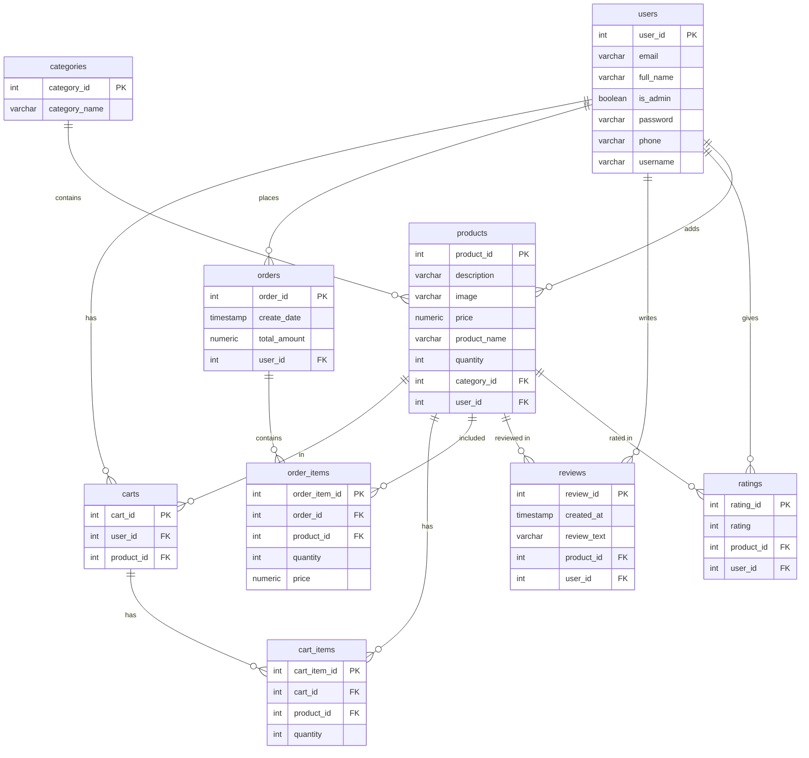

[//]: # (# Online Art Supplies Shop)

## Overview
The Online Art Supplies Shop is a web application designed to provide a seamless shopping experience for art enthusiasts. 
Users can register, browse, and purchase a variety of art supplies while having access to features like product ratings
and reviews.

## Business Requirements

1. **User Registration**
    - Customers can register for an account to access personalized features.

2. **User Login**
    - Registered users can log in to their accounts to view order history and manage personal information.

3. **Category filtering**
    - Users can filter the products by categories (e.g., paints, brushes, canvases) to easily find desired items.
   
4. **Product Search**
    - Users can search for specific products by name or keywords to quickly locate items of interest.

5. **Product Details Page**
    - Each product page shows important information, including price, product description, available quantity, and images.

6. **Shopping Cart Functionality**
    - Users can add products to a shopping cart, view total costs.

7. **Order History**
    - Users can view their previous orders, including details about purchased items.

8. **Admin Inventory Management**
    - Administrators can manage inventory by updating stock levels, adding new products, and removing outdated items.

9. **Product Rating System**
    - Users can rate products on a scale (e.g., 1-5 stars) to provide feedback on their purchases.

10. **Product Review System**
     - Customers can leave reviews for products, sharing their experiences and opinions with other users.

## Minimum Viable Product (MVP) Features

### 1. User Registration
Customers can create an account by providing their personal information, such as name, email, and password. This 
feature allows users to access personalized features, such as order history. The registration 
process includes validation to ensure the accuracy and completeness of the provided information.

### 2. Product Details Page
Each product page displays essential information about the product, including its price, detailed description, available
quantity, and images. This feature helps users make informed purchasing decisions by providing all necessary details in 
one place. 

### 3. Order History
Users can view their previous orders, including details about purchased items. This feature allows users to keep track
of their purchases and review past orders for reference.

### 4. Product Search
Users can search for specific products by entering keywords or product names in the search bar. This feature provides 
a list of matching products, allowing users to quickly locate items of interest. 

### 5. Product Rating System
Users can rate products on a scale (e.g., 1-5 stars) to provide feedback on their purchases. This feature allows 
customers to share their satisfaction level with the products they have bought. The ratings are aggregated and 
displayed on the product details page, helping other users make informed purchasing decisions based on the overall 
rating score.

# ER diagram

